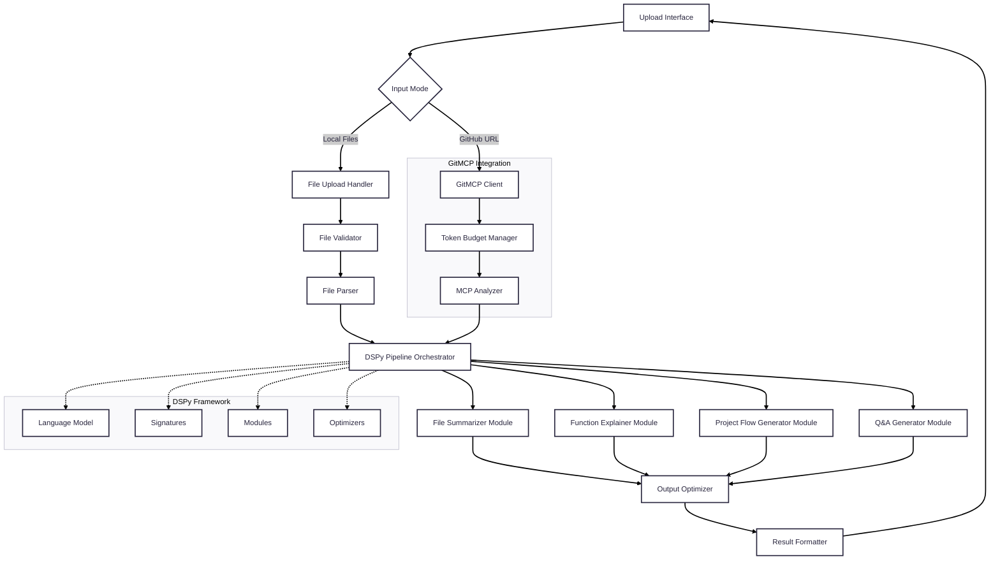
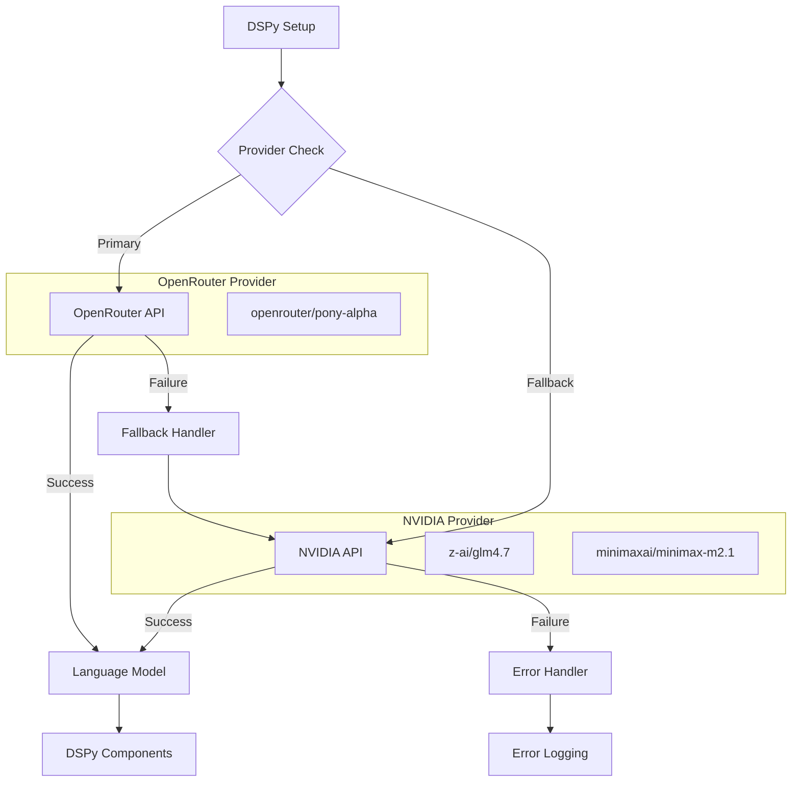

# Design Document: Code Analysis Pipeline

## Overview

The Code Analysis Pipeline is a sophisticated system that leverages DSPy's declarative framework to process uploaded code files through a multi-component analysis pipeline. The system transforms raw code files into comprehensive documentation and insights through four specialized DSPy modules: File Summarizer, Function Explainer, Project Flow Generator, and Q&A Generator.

The architecture follows DSPy's core principles of signatures (declarative task specifications), modules (composable processing units), and optimizers (self-improving components). The system integrates with Nvidia's API (https://integrate.api.nvidia.com/v1) for language model capabilities and uses Streamlit for the frontend dashboard. This design enables the system to automatically generate high-quality code documentation while maintaining transparency and modularity.

## Architecture

### High-Level Architecture



### Component Architecture

The system is organized into distinct layers:

1. **Presentation Layer**: Streamlit-based dashboard for file upload and result display
2. **Input Layer**: Hybrid mode supporting both local file upload and GitHub URL analysis
3. **Processing Layer**: File handling, validation, parsing, and GitMCP integration
4. **Analysis Layer**: DSPy pipeline with four specialized modules using Nvidia API
5. **Output Layer**: Result optimization, formatting, and export

## Components and Interfaces

### Input Mode Selection

**HybridInputHandler**
- Supports two input modes: Local Files and GitHub URL
- Provides mode selection interface in Streamlit
- Routes input to appropriate handler based on mode
- Validates input format before processing

### GitHub Repository Analysis (GitMCP Integration)

**GitMCPClient**
- Converts GitHub URLs to GitMCP MCP server URLs
- Validates GitHub URL format and connection
- Tracks token usage and tool calls for budget management
- Provides repository metadata extraction
- Implements context manager for resource cleanup

**URL Conversion Logic**
```python
# Supported GitHub URL formats:
# - https://github.com/user/repo
# - git@github.com:user/repo.git
# - github.com/user/repo

# Converts to: https://gitmcp.io/user/repo
```

**TokenBudgetManager**
- Enforces configurable token limits (default: 50,000 tokens)
- Enforces tool call limits (default: 100 calls)
- Tracks real-time token usage and tool calls
- Provides budget status and remaining capacity
- Prevents runaway API costs with pre-call validation

**Token Budget Strategies**
- Quick Overview: 10,000 tokens (~$0.10)
- Standard Analysis: 30,000 tokens (~$0.30)
- Deep Analysis: 50,000 tokens (~$0.50)
- Comprehensive: 100,000 tokens (~$1.00)

**MCPCodeAnalyzer** (DSPy Module)
- Analyzes GitHub repositories via MCP protocol
- Integrates with TokenBudgetManager for cost control
- Supports configurable analysis focus (overview, architecture, functions, dependencies, all)
- Provides detailed usage statistics after analysis
- Implements graceful error handling and fallback

**MCPRepositoryAnalyzer** (High-Level Orchestrator)
- Combines MCP and local parsing capabilities
- Supports three modes: "mcp" (GitHub only), "local" (files only), "hybrid" (both)
- Automatically detects input type and routes to appropriate handler
- Provides unified interface for both analysis modes

### File Upload and Validation System

**FileUploadHandler**
- Manages multi-file uploads with drag-and-drop support
- Validates file types (.py, .js, .ts, .java, .cpp, .c, .go, .rs, .rb, .php)
- Enforces size limits (10MB per file, 50 files maximum)
- Provides upload progress tracking and error reporting

**FileValidator**
- Performs MIME type validation and security scanning
- Checks file integrity and encoding
- Generates file metadata (size, type, encoding, line count)

### Code Parsing System

**UniversalCodeParser**
- Multi-language AST parsing using language-specific parsers
- Extracts structural elements: functions, classes, imports, comments
- Preserves code hierarchy and relationships
- Handles syntax errors gracefully with partial parsing

**ParsedCodeModel** (Pydantic)
```python
class ParsedCodeModel(BaseModel):
    file_path: str
    language: str
    functions: List[FunctionInfo]
    classes: List[ClassInfo]
    imports: List[ImportInfo]
    comments: List[CommentInfo]
    metadata: FileMetadata
    ast_structure: Dict[str, Any]
```

### DSPy Pipeline Components

#### 0. MCP Code Analyzer Module (Optional - GitMCP Integration)

**MCPCodeAnalysisSignature**
```python
class MCPCodeAnalysisSignature(dspy.Signature):
    """Analyze a GitHub repository using MCP tools for code understanding."""
    
    repository_url: str = dspy.InputField(desc="GitHub repository URL to analyze")
    analysis_focus: str = dspy.InputField(desc="What aspects to focus on: 'overview', 'architecture', 'functions', 'dependencies', or 'all'")
    mcp_server_url: str = dspy.InputField(desc="GitMCP server URL for accessing repository via MCP protocol")
    
    analysis_summary: str = dspy.OutputField(desc="Comprehensive analysis summary of the repository")
```

**MCPCodeAnalyzer** (DSPy Module)
```python
class MCPCodeAnalyzer(dspy.Module):
    def __init__(self, max_tokens: int = 50000, max_tool_calls: int = 100):
        super().__init__()
        self.analyzer = dspy.ChainOfThought(MCPCodeAnalysisSignature)
        self.budget_manager = TokenBudgetManager(max_tokens, max_tool_calls)
    
    def forward(self, github_url: str, analysis_focus: str = "all") -> Dict[str, Any]:
        # Analyze repository via GitMCP with budget enforcement
        pass
```

**Analysis Focus Options**
- `overview`: High-level repository summary and purpose
- `architecture`: System design, patterns, and structure
- `functions`: Detailed function and method analysis
- `dependencies`: Dependency mapping and relationships
- `all`: Comprehensive analysis covering all aspects

#### 1. File Summarizer Module

**FileSummarizerSignature**
```python
class FileSummarizerSignature(dspy.Signature):
    """Generate a comprehensive summary of a code file including its purpose, 
    main functionality, key components, and critical dependencies."""
    
    parsed_code: ParsedCodeModel = dspy.InputField(desc="Structured representation of the parsed code file")
    file_context: str = dspy.InputField(desc="Additional context about the file's role in the project")
    
    summary: FileSummary = dspy.OutputField(desc="Comprehensive file summary with purpose, functionality, and dependencies")
```

**FileSummary** (Pydantic)
```python
class FileSummary(BaseModel):
    purpose: str
    main_functionality: List[str]
    key_components: List[str]
    dependencies: List[str]
    complexity_score: int
    summary_text: str
```

#### 2. Function Explainer Module

**FunctionExplainerSignature**
```python
class FunctionExplainerSignature(dspy.Signature):
    """Provide detailed explanations of functions including parameters, 
    return values, logic flow, design patterns, and error handling."""
    
    function_info: FunctionInfo = dspy.InputField(desc="Function metadata and source code")
    context: str = dspy.InputField(desc="Surrounding code context and dependencies")
    
    explanation: FunctionExplanation = dspy.OutputField(desc="Detailed function explanation with logic breakdown")
```

**FunctionExplanation** (Pydantic)
```python
class FunctionExplanation(BaseModel):
    function_name: str
    purpose: str
    parameters: List[ParameterExplanation]
    return_value: str
    logic_steps: List[str]
    design_patterns: List[str]
    error_handling: List[str]
    complexity_analysis: str
```

#### 3. Project Flow Generator Module

**ProjectFlowSignature**
```python
class ProjectFlowSignature(dspy.Signature):
    """Generate project structure diagrams and data flow analysis 
    showing component relationships and execution paths."""
    
    project_files: List[ParsedCodeModel] = dspy.InputField(desc="All parsed files in the project")
    dependency_graph: Dict[str, List[str]] = dspy.InputField(desc="File dependency relationships")
    
    project_flow: ProjectFlow = dspy.OutputField(desc="Project structure and flow analysis")
```

**ProjectFlow** (Pydantic)
```python
class ProjectFlow(BaseModel):
    structure_diagram: str
    execution_paths: List[ExecutionPath]
    data_flow_patterns: List[DataFlowPattern]
    dependency_analysis: DependencyAnalysis
    circular_dependencies: List[str]
    architectural_insights: List[str]
```

#### 4. Q&A Generator Module

**QAGeneratorSignature**
```python
class QAGeneratorSignature(dspy.Signature):
    """Generate educational question-answer pairs about the codebase 
    covering functionality, implementation details, and best practices."""
    
    analysis_results: AnalysisResults = dspy.InputField(desc="Combined results from all analysis modules")
    difficulty_level: str = dspy.InputField(desc="Target difficulty level for questions")
    
    qa_pairs: QAPairs = dspy.OutputField(desc="Generated question-answer pairs with varying difficulty")
```

**QAPairs** (Pydantic)
```python
class QAPairs(BaseModel):
    basic_questions: List[QuestionAnswer]
    intermediate_questions: List[QuestionAnswer]
    advanced_questions: List[QuestionAnswer]
    edge_case_questions: List[QuestionAnswer]
    total_count: int
```

### DSPy and Nvidia API Integration

**DSPy Configuration with Nvidia Models**
```python
import dspy
from dspy import OpenAI

# Configure DSPy to use Nvidia API
nvidia_lm = OpenAI(
    api_base="https://integrate.api.nvidia.com/v1",
    api_key="your-nvidia-api-key",
    model="nvidia/llama-3.1-nemotron-70b-instruct"  # or other Nvidia models
)

dspy.settings.configure(lm=nvidia_lm)
```

**Model Selection Strategy**
- Primary: `nvidia/llama-3.1-nemotron-70b-instruct` for complex analysis tasks
- Alternative: `nvidia/llama-3.1-8b-instruct` for faster processing
- Fallback: Local models for offline operation

### Multi-Provider API Support with OpenRouter

**Design Overview**

The system supports multiple API providers with automatic fallback mechanisms to ensure reliability and cost optimization. OpenRouter serves as the primary provider, with NVIDIA API as the fallback option.

**Provider Architecture**



**Multi-Provider Configuration**

```python
class MultiProviderConfig(BaseModel):
    """Configuration for multi-provider API support."""
    
    # Primary Provider (OpenRouter)
    openrouter_api_key: str = Field(default_factory=lambda: os.getenv("OPENROUTER_API_KEY", ""))
    openrouter_api_base: str = "https://openrouter.ai/api/v1"
    openrouter_primary_model: str = "openrouter/pony-alpha"
    
    # Fallback Provider (NVIDIA)
    nvidia_api_key: str = Field(default_factory=lambda: os.getenv("NVIDIA_API_KEY", ""))
    nvidia_api_base: str = "https://integrate.api.nvidia.com/v1"
    nvidia_fallback_model: str = "z-ai/glm4.7"
    nvidia_alternative_model: str = "minimaxai/minimax-m2.1"
    
    # Provider Settings
    primary_provider: str = "openrouter"  # "openrouter" or "nvidia"
    enable_fallback: bool = True
    fallback_timeout_seconds: int = 5
    max_retries_per_provider: int = 3
    
    # Common Settings
    max_tokens: int = 4096
    temperature: float = 0.1
    timeout_seconds: int = 60
    streaming_enabled: bool = True
```

**Provider Initialization Logic**

```python
class MultiProviderLanguageModel:
    """Language model wrapper supporting multiple API providers."""
    
    def __init__(self, config: MultiProviderConfig):
        self.config = config
        self.current_provider = None
        self.primary_client = None
        self.fallback_client = None
        
        # Initialize providers
        self._initialize_providers()
    
    def _initialize_providers(self):
        """Initialize both primary and fallback providers."""
        
        # Initialize OpenRouter (Primary)
        if self.config.openrouter_api_key:
            try:
                self.primary_client = OpenAI(
                    api_key=self.config.openrouter_api_key,
                    base_url=self.config.openrouter_api_base,
                    timeout=self.config.timeout_seconds,
                )
                self.current_provider = "openrouter"
                logger.info(f"Initialized OpenRouter with model: {self.config.openrouter_primary_model}")
            except Exception as e:
                logger.warning(f"Failed to initialize OpenRouter: {e}")
        
        # Initialize NVIDIA (Fallback)
        if self.config.nvidia_api_key:
            try:
                self.fallback_client = OpenAI(
                    api_key=self.config.nvidia_api_key,
                    base_url=self.config.nvidia_api_base,
                    timeout=self.config.timeout_seconds,
                )
                logger.info(f"Initialized NVIDIA fallback with model: {self.config.nvidia_fallback_model}")
            except Exception as e:
                logger.warning(f"Failed to initialize NVIDIA fallback: {e}")
        
        # Validate at least one provider is available
        if not self.primary_client and not self.fallback_client:
            raise ValueError("No API providers available. Set OPENROUTER_API_KEY or NVIDIA_API_KEY")
    
    def __call__(self, prompt: str, **kwargs) -> str:
        """Generate response with automatic fallback."""
        
        # Try primary provider first
        if self.primary_client and self.current_provider == "openrouter":
            try:
                return self._call_openrouter(prompt, **kwargs)
            except Exception as e:
                logger.error(f"OpenRouter API failed: {e}")
                if self.config.enable_fallback and self.fallback_client:
                    logger.info("Falling back to NVIDIA API")
                    self.current_provider = "nvidia"
                else:
                    raise
        
        # Try fallback provider
        if self.fallback_client and self.current_provider == "nvidia":
            try:
                return self._call_nvidia(prompt, **kwargs)
            except Exception as e:
                logger.error(f"NVIDIA API failed: {e}")
                raise
        
        raise RuntimeError("All API providers failed")
    
    def _call_openrouter(self, prompt: str, **kwargs) -> str:
        """Call OpenRouter API."""
        response = self.primary_client.chat.completions.create(
            model=self.config.openrouter_primary_model,
            messages=[{"role": "user", "content": prompt}],
            max_tokens=kwargs.get("max_tokens", self.config.max_tokens),
            temperature=kwargs.get("temperature", self.config.temperature),
            stream=self.config.streaming_enabled,
        )
        
        if self.config.streaming_enabled:
            return self._handle_streaming_response(response)
        else:
            return response.choices[0].message.content
    
    def _call_nvidia(self, prompt: str, **kwargs) -> str:
        """Call NVIDIA API."""
        response = self.fallback_client.chat.completions.create(
            model=self.config.nvidia_fallback_model,
            messages=[{"role": "user", "content": prompt}],
            max_tokens=kwargs.get("max_tokens", self.config.max_tokens),
            temperature=kwargs.get("temperature", self.config.temperature),
            stream=self.config.streaming_enabled,
        )
        
        if self.config.streaming_enabled:
            return self._handle_streaming_response(response)
        else:
            return response.choices[0].message.content
    
    def _handle_streaming_response(self, response) -> str:
        """Handle streaming response from API."""
        chunks = []
        for chunk in response:
            if chunk.choices[0].delta.content:
                chunks.append(chunk.choices[0].delta.content)
        return "".join(chunks)
    
    def get_current_provider(self) -> str:
        """Get the currently active provider."""
        return self.current_provider
    
    def switch_to_alternative_model(self):
        """Switch to alternative NVIDIA model for specialized use cases."""
        if self.fallback_client:
            self.config.nvidia_fallback_model = self.config.nvidia_alternative_model
            logger.info(f"Switched to alternative model: {self.config.nvidia_alternative_model}")
```

**Provider Fallback Strategy**

1. **Primary Attempt**: Try OpenRouter API with `openrouter/pony-alpha` model
2. **Fallback on Failure**: If OpenRouter fails (timeout, rate limit, error), automatically switch to NVIDIA API
3. **NVIDIA Fallback**: Use `z-ai/glm4.7` model on NVIDIA API
4. **Alternative Model**: Support `minimaxai/minimax-m2.1` for specialized use cases
5. **Error Handling**: Log all provider switches and failures for monitoring

**Configuration Validation**

```python
def validate_multi_provider_config(config: MultiProviderConfig) -> List[str]:
    """Validate multi-provider configuration."""
    errors = []
    
    # Check at least one API key is present
    if not config.openrouter_api_key and not config.nvidia_api_key:
        errors.append("At least one API key (OPENROUTER_API_KEY or NVIDIA_API_KEY) is required")
    
    # Validate primary provider setting
    if config.primary_provider not in ["openrouter", "nvidia"]:
        errors.append("primary_provider must be 'openrouter' or 'nvidia'")
    
    # Validate timeout settings
    if config.timeout_seconds <= 0:
        errors.append("timeout_seconds must be positive")
    
    if config.fallback_timeout_seconds <= 0:
        errors.append("fallback_timeout_seconds must be positive")
    
    # Validate retry settings
    if config.max_retries_per_provider < 0:
        errors.append("max_retries_per_provider must be non-negative")
    
    return errors
```

**Environment Configuration**

```bash
# Primary Provider (OpenRouter)
OPENROUTER_API_KEY=your_openrouter_api_key_here

# Fallback Provider (NVIDIA)
NVIDIA_API_KEY=your_nvidia_api_key_here

# Optional: Override default models
OPENROUTER_PRIMARY_MODEL=openrouter/pony-alpha
NVIDIA_FALLBACK_MODEL=z-ai/glm4.7
NVIDIA_ALTERNATIVE_MODEL=minimaxai/minimax-m2.1

# Optional: Provider settings
PRIMARY_PROVIDER=openrouter
ENABLE_FALLBACK=true
STREAMING_ENABLED=true
```

**Model Configuration (config/dspy_models.yaml)**

```yaml
# Multi-Provider Model Configuration

providers:
  openrouter:
    api_base: "https://openrouter.ai/api/v1"
    primary_model: "openrouter/pony-alpha"
    description: "Primary provider with OpenRouter API"
    timeout_seconds: 60
    max_retries: 3
    
  nvidia:
    api_base: "https://integrate.api.nvidia.com/v1"
    fallback_model: "z-ai/glm4.7"
    alternative_model: "minimaxai/minimax-m2.1"
    description: "Fallback provider with NVIDIA API"
    timeout_seconds: 60
    max_retries: 3

# Provider selection strategy
provider_strategy:
  primary: "openrouter"
  fallback_enabled: true
  fallback_on_errors:
    - "timeout"
    - "rate_limit"
    - "server_error"
  auto_switch_back: false  # Stay on fallback once switched

# Model-specific settings
models:
  openrouter/pony-alpha:
    max_tokens: 4096
    temperature: 0.1
    streaming: true
    recommended_for:
      - "Complex analysis"
      - "Large codebases"
      - "Detailed explanations"
  
  z-ai/glm4.7:
    max_tokens: 4096
    temperature: 0.1
    streaming: true
    recommended_for:
      - "Fallback processing"
      - "Quick analysis"
      - "Standard documentation"
  
  minimaxai/minimax-m2.1:
    max_tokens: 4096
    temperature: 0.1
    streaming: true
    recommended_for:
      - "Specialized analysis"
      - "Alternative processing"
```

**Integration with DSPy Setup**

```python
def setup_dspy_multi_provider(
    openrouter_api_key: Optional[str] = None,
    nvidia_api_key: Optional[str] = None,
) -> None:
    """Set up DSPy with multi-provider support."""
    
    # Create multi-provider config
    config = MultiProviderConfig(
        openrouter_api_key=openrouter_api_key or os.getenv("OPENROUTER_API_KEY", ""),
        nvidia_api_key=nvidia_api_key or os.getenv("NVIDIA_API_KEY", ""),
    )
    
    # Validate configuration
    errors = validate_multi_provider_config(config)
    if errors:
        raise ValueError(f"Configuration errors: {', '.join(errors)}")
    
    try:
        # Create multi-provider language model
        multi_provider_lm = MultiProviderLanguageModel(config)
        
        # Configure DSPy settings
        dspy.settings.configure(lm=multi_provider_lm)
        
        logger.info(f"DSPy configured with multi-provider support - Primary: {config.primary_provider}")
        
    except Exception as e:
        logger.error(f"Failed to setup DSPy with multi-provider: {e}")
        raise
```

**Provider Monitoring and Logging**

```python
class ProviderMonitor:
    """Monitor API provider usage and performance."""
    
    def __init__(self):
        self.provider_stats = {
            "openrouter": {"calls": 0, "failures": 0, "total_time": 0},
            "nvidia": {"calls": 0, "failures": 0, "total_time": 0},
        }
        self.fallback_events = []
    
    def record_call(self, provider: str, success: bool, duration: float):
        """Record API call statistics."""
        self.provider_stats[provider]["calls"] += 1
        if not success:
            self.provider_stats[provider]["failures"] += 1
        self.provider_stats[provider]["total_time"] += duration
    
    def record_fallback(self, from_provider: str, to_provider: str, reason: str):
        """Record provider fallback event."""
        self.fallback_events.append({
            "timestamp": datetime.now(),
            "from": from_provider,
            "to": to_provider,
            "reason": reason,
        })
        logger.warning(f"Provider fallback: {from_provider} -> {to_provider} ({reason})")
    
    def get_statistics(self) -> Dict[str, Any]:
        """Get provider usage statistics."""
        return {
            "provider_stats": self.provider_stats,
            "fallback_events": self.fallback_events,
            "total_calls": sum(stats["calls"] for stats in self.provider_stats.values()),
            "total_failures": sum(stats["failures"] for stats in self.provider_stats.values()),
        }
```

**Correctness Properties for Multi-Provider Support**

### Property 13: Provider Initialization
*For any* valid API configuration with at least one API key, the system should successfully initialize the corresponding provider(s) and configure DSPy
**Validates: Requirement 13.1, 13.7**

### Property 14: Automatic Fallback
*For any* API call failure on the primary provider, the system should automatically attempt the fallback provider without user intervention and log the provider switch
**Validates: Requirement 13.2, 13.6, 13.12**

### Property 15: Model Selection
*For any* provider, the system should use the correct model: `openrouter/pony-alpha` for OpenRouter, `z-ai/glm4.7` for NVIDIA fallback, and support `minimaxai/minimax-m2.1` as alternative
**Validates: Requirement 13.3, 13.4, 13.5**

### Property 16: Error Handling and Reporting
*For any* scenario where both providers fail, the system should provide clear error messages with troubleshooting steps and not leave the system in an inconsistent state
**Validates: Requirement 13.8**

### Property 17: OpenAI-Compatible Interface
*For any* API provider, the system should use the OpenAI-compatible client interface and support streaming completions when enabled
**Validates: Requirement 13.9, 13.10**

### Property 18: Environment-Based Configuration
*For any* deployment environment, the system should correctly load API keys, base URLs, and model names from environment variables
**Validates: Requirement 13.11**

### Streamlit Frontend Architecture

**StreamlitDashboard**
- File upload component with drag-and-drop support
- Real-time progress tracking with progress bars
- Tabbed interface for different analysis results
- Download buttons for generated reports
- Error display with user-friendly messages

**Dashboard Components**
```python
import streamlit as st

class CodeAnalysisDashboard:
    def __init__(self):
        self.setup_page_config()
        self.initialize_session_state()
    
    def render_upload_section(self):
        # File upload with validation
        pass
    
    def render_progress_section(self):
        # Real-time progress tracking
        pass
    
    def render_results_section(self):
        # Tabbed results display
        pass
```

### DSPy Pipeline Orchestrator

**PipelineOrchestrator**
- Coordinates execution of all four DSPy modules
- Implements parallel processing where possible
- Manages module dependencies and data flow
- Provides progress tracking and error recovery
- Handles module optimization and compilation

```python
class CodeAnalysisPipeline(dspy.Module):
    def __init__(self):
        super().__init__()
        self.file_summarizer = dspy.ChainOfThought(FileSummarizerSignature)
        self.function_explainer = dspy.ChainOfThought(FunctionExplainerSignature)
        self.project_flow_generator = dspy.ChainOfThought(ProjectFlowSignature)
        self.qa_generator = dspy.ChainOfThought(QAGeneratorSignature)
    
    def forward(self, parsed_files: List[ParsedCodeModel]) -> AnalysisResults:
        # Orchestrate all modules with proper data flow
        pass
```

## Data Models

### Core Data Structures

**FunctionInfo**
```python
class FunctionInfo(BaseModel):
    name: str
    parameters: List[Parameter]
    return_type: Optional[str]
    docstring: Optional[str]
    source_code: str
    line_start: int
    line_end: int
    complexity_metrics: ComplexityMetrics
    dependencies: List[str]
```

**ClassInfo**
```python
class ClassInfo(BaseModel):
    name: str
    methods: List[FunctionInfo]
    attributes: List[Attribute]
    inheritance: List[str]
    docstring: Optional[str]
    source_code: str
    design_patterns: List[str]
```

**AnalysisResults**
```python
class AnalysisResults(BaseModel):
    file_summaries: List[FileSummary]
    function_explanations: List[FunctionExplanation]
    project_flow: ProjectFlow
    qa_pairs: QAPairs
    processing_metadata: ProcessingMetadata
    optimization_metrics: OptimizationMetrics
```

## Correctness Properties

*A property is a characteristic or behavior that should hold true across all valid executions of a system—essentially, a formal statement about what the system should do. Properties serve as the bridge between human-readable specifications and machine-verifiable correctness guarantees.*

Before writing the correctness properties, I need to analyze the acceptance criteria from the requirements document to determine which ones are testable as properties.

<function_calls>
<invoke name="prework">
<parameter name="featureName">code-analysis-pipeline

### Property 1: File Upload Validation
*For any* uploaded file, the system should accept it if and only if it has a valid file extension (.py, .js, .ts, .java, .cpp, .c, .go, .rs, .rb, .php), is under 10MB in size, and provide appropriate error messages for invalid files
**Validates: Requirements 1.1, 1.2, 1.3**

### Property 2: Upload Confirmation and Limits
*For any* successful file upload, the system should display confirmation with correct file names and sizes, and enforce the 50-file batch upload limit
**Validates: Requirements 1.4, 1.5**

### Property 3: Code Parsing Completeness
*For any* valid code file, the parser should extract all functions, classes, imports, and comments while preserving code structure, line numbers, and generating complete metadata
**Validates: Requirements 2.1, 2.4, 2.5**

### Property 4: Parser Error Resilience
*For any* batch of files containing syntax errors or mixed languages, the parser should handle errors gracefully, continue processing other files, and detect languages appropriately
**Validates: Requirements 2.2, 2.3**

### Property 5: File Summary Generation
*For any* parsed code file, the File Summarizer should generate a summary containing purpose, main functionality, key components, and dependencies while maintaining consistent format and staying within 500 words
**Validates: Requirements 3.1, 3.2, 3.3, 3.4, 3.5**

### Property 6: Function Explanation Completeness
*For any* identified function, the Function Explainer should generate explanations including parameters, return values, purpose, logic breakdown, design patterns, and error handling documentation
**Validates: Requirements 4.1, 4.2, 4.3, 4.4, 4.5**

### Property 7: Project Flow Analysis
*For any* multi-file project, the Project Flow Generator should create structure diagrams, identify execution paths and data flow patterns, map dependencies, and detect circular dependencies
**Validates: Requirements 5.1, 5.2, 5.3, 5.4, 5.5**

### Property 8: Q&A Generation Completeness
*For any* analyzed codebase, the Q&A Generator should create question-answer pairs covering key functionality with multiple difficulty levels, meeting minimum quantity requirements, and including edge case coverage
**Validates: Requirements 6.1, 6.2, 6.3, 6.4, 6.5**

### Property 9: DSPy Pipeline Execution
*For any* analysis request, the DSPy Pipeline should execute all four components in correct sequence, handle component failures gracefully, track progress, and aggregate results properly
**Validates: Requirements 7.1, 7.2, 7.4, 7.5**

### Property 10: Parallel Processing Optimization
*For any* large codebase, the DSPy Pipeline should implement parallel processing where possible to optimize performance
**Validates: Requirements 7.3**

### Property 11: Output Generation and Formatting
*For any* completed pipeline processing, the Output Optimizer should format results into structured documents, create multiple format options (JSON, Markdown, HTML), generate downloadable reports, and provide search/navigation functionality
**Validates: Requirements 8.1, 8.2, 8.4, 8.5**

### Property 12: Large Dataset Handling
*For any* large amount of processed data, the Output Optimizer should implement pagination and filtering capabilities
**Validates: Requirements 8.3**

### Property 13: Comprehensive Error Handling
*For any* system error (upload failures, parsing errors, component errors, critical errors), the system should provide specific error messages, continue processing where possible, log detailed information, and preserve user data
**Validates: Requirements 9.1, 9.2, 9.3, 9.5**

### Property 14: Resource Management
*For any* resource-constrained situation, the system should queue requests and notify users of expected processing times
**Validates: Requirements 9.4**

### Property 15: Performance Requirements
*For any* processing request, the system should complete small files (under 1MB) within 30 seconds and maintain UI response times under 5 seconds for multiple concurrent users
**Validates: Requirements 10.1, 10.3**

### Property 16: Progress Indication and Caching
*For any* large codebase processing, the system should provide progress indicators and estimated completion times, and implement caching to avoid reprocessing unchanged files
**Validates: Requirements 10.2, 10.4**

### Property 17: Load Management
*For any* high system load situation, the system should implement request queuing with fair scheduling
**Validates: Requirements 10.5**

### Property 18: User Interface Functionality
*For any* user interaction, the interface should provide clear instructions, drag-and-drop functionality, real-time progress indicators, organized result display, export options, and user-friendly error messages
**Validates: Requirements 11.1, 11.2, 11.3, 11.4, 11.5**

### Property 19: GitHub URL Validation and Conversion
*For any* GitHub repository URL provided, the GitMCP_Client should validate the URL format, convert it to a GitMCP MCP server URL, and validate the connection
**Validates: Requirements 12.1, 12.4**

### Property 20: Token Budget Enforcement
*For any* MCP-based analysis, the Token_Budget_Manager should enforce configurable token limits and tool call limits, stop processing when budget is exceeded, and report accurate usage statistics
**Validates: Requirements 12.2, 12.3, 12.6**

### Property 21: Hybrid Mode Support
*For any* user input, the system should support both local file upload and GitHub URL analysis, provide clear mode selection, and route input to the appropriate handler
**Validates: Requirements 12.5, 12.7**

### Property 22: MCP Analysis Configuration
*For any* GitHub repository analysis, the MCP_Analyzer should support configurable analysis focus options and provide comprehensive results based on the selected focus
**Validates: Requirements 12.8**

## Error Handling

### Error Categories and Strategies

**File Upload Errors**
- Invalid file types: Clear rejection with supported format list
- Size limit exceeded: Specific error with file size and limit information
- Network failures: Retry mechanism with exponential backoff
- Batch upload failures: Partial success reporting with failed file details

**Parsing Errors**
- Syntax errors: Graceful degradation with partial parsing results
- Encoding issues: Automatic encoding detection and conversion
- Unsupported language features: Warning logs with continued processing
- Memory constraints: Streaming parser for large files

**DSPy Component Errors**
- Language model failures: Fallback to cached results or simplified analysis
- Timeout errors: Configurable timeout with progress preservation
- Rate limiting: Automatic retry with exponential backoff
- Invalid responses: Response validation with error recovery

**GitMCP-Specific Errors**
- Invalid GitHub URL: Clear error message with expected format examples
- Connection failures: Retry mechanism with exponential backoff
- Token budget exceeded: Stop processing and report usage statistics
- Tool call limit reached: Graceful termination with partial results
- MCP server unavailable: Fallback to local analysis mode (if hybrid)
- Repository access denied: Clear error message for private repositories

**System-Level Errors**
- Resource exhaustion: Request queuing with user notification
- Database failures: Graceful degradation with local caching
- Network connectivity: Offline mode with result synchronization
- Critical system errors: Data preservation with recovery options

### Error Recovery Mechanisms

**Graceful Degradation**
- Component failures don't stop entire pipeline
- Partial results are preserved and presented
- Alternative analysis methods when primary methods fail
- User notification of reduced functionality

**Data Preservation**
- Automatic saving of intermediate results
- Recovery from last successful checkpoint
- User data backup before critical operations
- Transaction rollback for failed operations

## Testing Strategy

### Dual Testing Approach

The system employs both unit testing and property-based testing to ensure comprehensive coverage:

**Unit Tests**
- Focus on specific examples and edge cases
- Test integration points between components
- Validate error conditions and boundary cases
- Test UI interactions and user workflows

**Property-Based Tests**
- Verify universal properties across all inputs
- Use randomized input generation for comprehensive coverage
- Test system behavior under various conditions
- Validate correctness properties from the design document

### Property-Based Testing Configuration

**Framework Selection**: Hypothesis (Python) for property-based testing
**Test Configuration**: Minimum 100 iterations per property test
**Test Tagging**: Each property test references its design document property using the format:
```python
# Feature: code-analysis-pipeline, Property 1: File Upload Validation
```

**Property Test Implementation Requirements**:
- Each correctness property must be implemented by a single property-based test
- Tests must generate randomized inputs within valid domains
- Tests must verify the universal quantification statements
- Tests must include edge case generation strategies

### Testing Coverage Areas

**File Processing Tests**
- Multi-language file parsing with various syntactic structures
- File size and format validation across supported types
- Batch upload scenarios with mixed valid/invalid files
- Error handling for corrupted or malformed files

**DSPy Pipeline Tests**
- Component execution order and data flow validation
- Error recovery and graceful degradation scenarios
- Performance testing with large codebases
- Result aggregation and consistency verification

**Output Generation Tests**
- Format validation for JSON, Markdown, and HTML outputs
- Content completeness and accuracy verification
- Search and navigation functionality testing
- Export functionality across different result sizes

**Integration Tests**
- End-to-end workflow testing from upload to results
- Multi-user concurrent access scenarios
- System resource management under load
- Data persistence and recovery testing

### Performance Testing

**Load Testing**
- Concurrent user simulation up to expected capacity
- Large file processing (up to 100MB) performance validation
- Memory usage monitoring during intensive operations
- Response time measurement for UI interactions

**Scalability Testing**
- Horizontal scaling validation for increased load
- Database performance under high query volumes
- Caching effectiveness measurement
- Resource utilization optimization verification