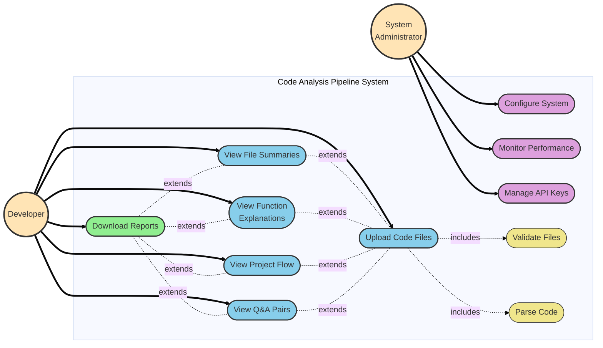
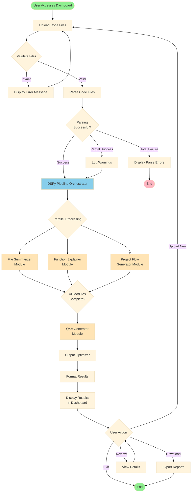
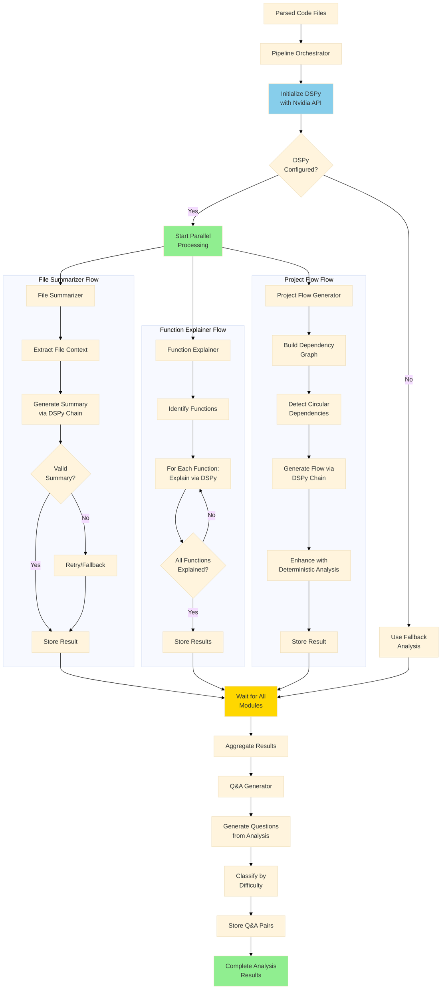
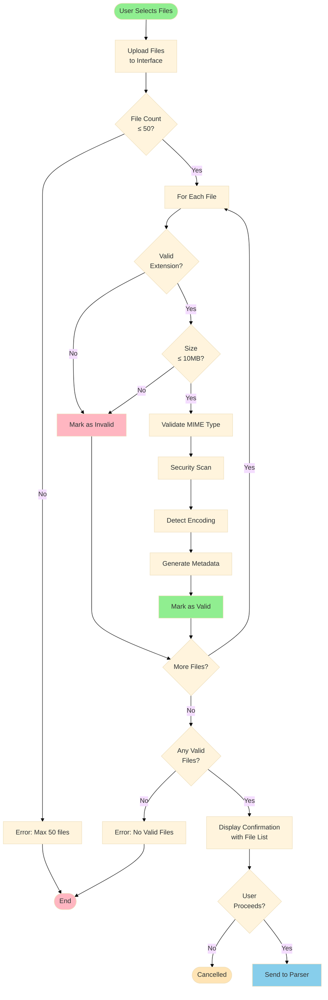
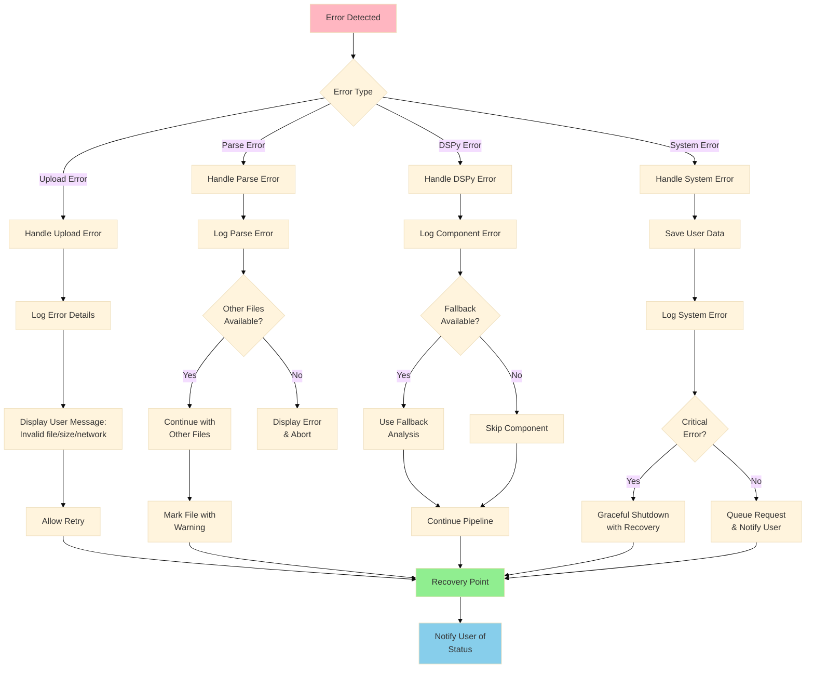
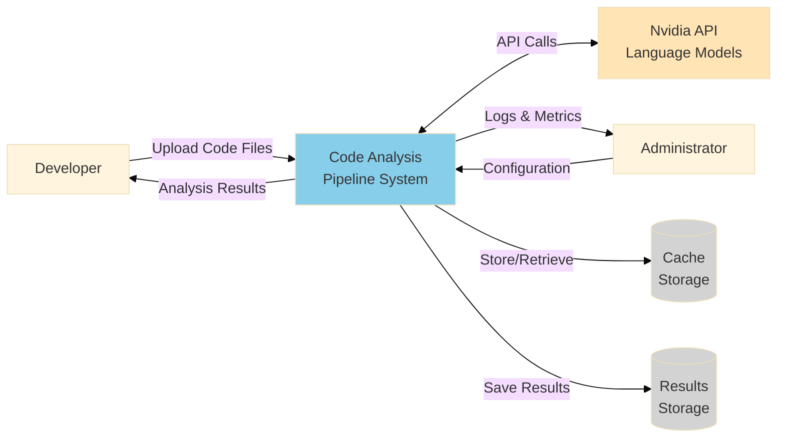
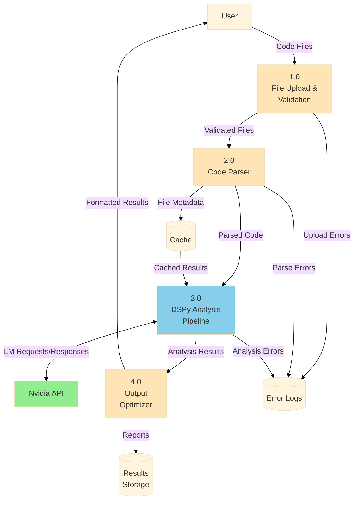
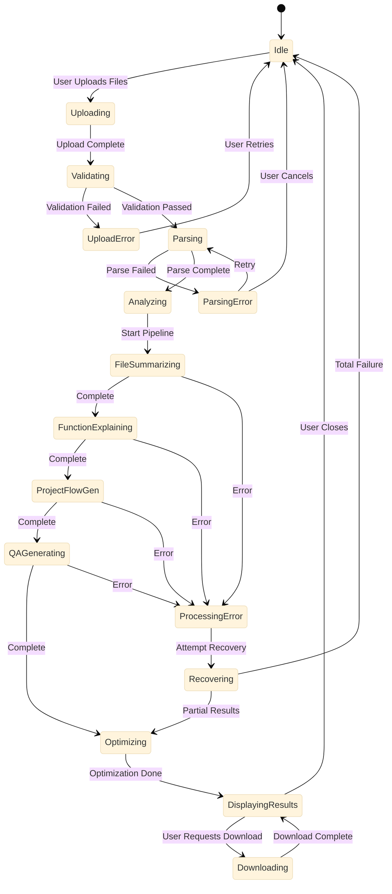

# Code Analysis Pipeline - Diagrams

## 1. System Use Case Diagram



## 2. High-Level Process Flow Diagram



## 3. Detailed DSPy Pipeline Process Flow



## 4. File Upload and Validation Flow



## 5. Error Handling Flow



## 6. Data Flow Diagram (Level 0 - Context Diagram)



## 7. Data Flow Diagram (Level 1 - System Decomposition)



## 8. Sequence Diagram - Complete Analysis Flow

```mermaid
---
config:
  theme: base
---
sequenceDiagram
    actor User
    participant UI as Streamlit Dashboard
    participant FH as File Handler
    participant Parser as Code Parser
    participant Orch as Pipeline Orchestrator
    participant FS as File Summarizer
    participant FE as Function Explainer
    participant PFG as Project Flow Gen
    participant QA as Q&A Generator
    participant LM as Nvidia API
    participant Opt as Output Optimizer
    
    User->>UI: Upload Files
    UI->>FH: Validate Files
    FH->>UI: Validation Result
    
    alt Invalid Files
        UI->>User: Display Errors
    else Valid Files
        UI->>Parser: Parse Files
        Parser->>Parser: Extract Structure
        Parser->>UI: Parsed Code Models
        
        UI->>Orch: Start Analysis
        
        par Parallel Processing
            Orch->>FS: Summarize Files
            FS->>LM: Request Summary
            LM-->>FS: Summary Response
            FS->>Orch: File Summaries
        and
            Orch->>FE: Explain Functions
            loop For Each Function
                FE->>LM: Request Explanation
                LM-->>FE: Explanation Response
            end
            FE->>Orch: Function Explanations
        and
            Orch->>PFG: Generate Flow
            PFG->>PFG: Build Dep Graph
            PFG->>LM: Request Flow Analysis
            LM-->>PFG: Flow Response
            PFG->>Orch: Project Flow
        end
        
        Orch->>QA: Generate Q&A
        QA->>LM: Request Questions
        LM-->>QA: Q&A Pairs
        QA->>Orch: Q&A Results
        
        Orch->>Opt: Optimize Output
        Opt->>Opt: Format Results
        Opt->>UI: Formatted Results
        
        UI->>User: Display Results
        
        User->>UI: Download Report
        UI->>Opt: Generate Export
        Opt->>User: Download File
    end
```

## 9. State Diagram - Analysis Process States



---

# UI Wireframes & Mockups

## 10. Wireframe - Initial Upload Screen

```
┌─────────────────────────────────────────────────────────────────────┐
│  Code Analysis Pipeline                                    [⚙ Settings] │
├─────────────────────────────────────────────────────────────────────┤
│                                                                     │
│  📁 Upload Code Files                                               │
│  ═══════════════════════════════════════════════════════════      │
│                                                                     │
│  ┌───────────────────────────────────────────────────────────┐    │
│  │                                                           │    │
│  │            🗂️  Drag and drop files here                  │    │
│  │                   or click to browse                      │    │
│  │                                                           │    │
│  │     Supported: .py .js .ts .java .cpp .c .go .rs .rb .php │    │
│  │     Max: 10MB per file, 50 files total                    │    │
│  │                                                           │    │
│  └───────────────────────────────────────────────────────────┘    │
│                                                                     │
│  📋 Instructions:                                                   │
│  • Upload your code files using the area above                     │
│  • Files will be validated automatically                           │
│  • Analysis includes: summaries, explanations, flow & Q&A          │
│  • Processing time: ~30s for small files (<1MB)                    │
│                                                                     │
│  ℹ️  Powered by DSPy & Nvidia API                                   │
│                                                                     │
└─────────────────────────────────────────────────────────────────────┘
```

## 11. Wireframe - File Validation Screen

```
┌─────────────────────────────────────────────────────────────────────┐
│  Code Analysis Pipeline                        🏠 Home │ [⚙ Settings] │
├─────────────────────────────────────────────────────────────────────┤
│                                                                     │
│  ✅ Files Uploaded Successfully                                     │
│  ═══════════════════════════════════════════════════════════      │
│                                                                     │
│  ┏━━━━━━━━━━━━━━━━━━━━━━━━━━━━━━━━━━━━━━━━━━━━━━━━━━━━━━━━━┓    │
│  ┃  File Name           Size    Language   Status          ┃    │
│  ┣━━━━━━━━━━━━━━━━━━━━━━━━━━━━━━━━━━━━━━━━━━━━━━━━━━━━━━━━━┫    │
│  ┃  ✓ main.py          1.2KB    Python     Valid           ┃    │
│  ┃  ✓ utils.py         3.5KB    Python     Valid           ┃    │
│  ┃  ✓ config.js        4.1KB    JavaScript Valid           ┃    │
│  ┃  ✓ helpers.ts       2.8KB    TypeScript Valid           ┃    │
│  ┃  ⚠ large.py         11.2KB   Python     Too Large       ┃    │
│  ┗━━━━━━━━━━━━━━━━━━━━━━━━━━━━━━━━━━━━━━━━━━━━━━━━━━━━━━━━━┛    │
│                                                                     │
│  📊 Summary:                                                        │
│  • Total Files: 5                                                  │
│  • Valid Files: 4 ✓                                                │
│  • Invalid Files: 1 ⚠                                              │
│  • Total Size: 10.4KB                                              │
│                                                                     │
│     [ ← Upload More ]  [❌ Cancel]      [▶️ Start Analysis ]       │
│                                                                     │
└─────────────────────────────────────────────────────────────────────┘
```

## 12. Wireframe - Analysis in Progress

```
┌─────────────────────────────────────────────────────────────────────┐
│  Code Analysis Pipeline                        🏠 Home │ [⚙ Settings] │
├─────────────────────────────────────────────────────────────────────┤
│                                                                     │
│  ⏳ Analysis in Progress...                                         │
│  ═══════════════════════════════════════════════════════════      │
│                                                                     │
│  ┌─────────────────────────────────────────────────────────────┐  │
│  │  Overall Progress               [████████░░░░] 65%          │  │
│  └─────────────────────────────────────────────────────────────┘  │
│                                                                     │
│  Pipeline Components:                                               │
│                                                                     │
│  ✅ File Parsing                    [██████████] Complete           │
│     └─ 4 files parsed successfully                                  │
│                                                                     │
│  🔄 File Summarizer                 [████████░░] 80%                │
│     └─ Generating summaries via Nvidia API...                       │
│                                                                     │
│  🔄 Function Explainer              [██████░░░░] 60%                │
│     └─ Analyzing 12 functions...                                    │
│                                                                     │
│  ⏸️ Project Flow Generator          [░░░░░░░░░░] Waiting...         │
│     └─ Will start after summaries complete                          │
│                                                                     │
│  ⏸️ Q&A Generator                   [░░░░░░░░░░] Waiting...         │
│     └─ Pending previous components                                  │
│                                                                     │
│  ⏱️ Estimated time remaining: ~15 seconds                           │
│                                                                     │
│                         [⏹️ Cancel Analysis]                        │
│                                                                     │
└─────────────────────────────────────────────────────────────────────┘
```

## 13. Wireframe - Results Dashboard (Tabbed View)

```
┌─────────────────────────────────────────────────────────────────────┐
│  Code Analysis Pipeline                        🏠 Home │ [⚙ Settings] │
├─────────────────────────────────────────────────────────────────────┤
│                                                                     │
│  ✨ Analysis Complete!                                              │
│  ═══════════════════════════════════════════════════════════      │
│                                                                     │
│  ┌───────┬──────────┬──────────┬─────────┬────────┐                │
│  │ 📄 Files │ 🔧 Functions │ 🌐 Flow │ ❓ Q&A │ 📊 Export │         │
│  └───────┴──────────┴──────────┴─────────┴────────┘                │
│  ┏━━━━━━━━━━━━━━━━━━━━━━━━━━━━━━━━━━━━━━━━━━━━━━━━━━━━━━━━━┓    │
│  ┃  📄 File Summaries                                      ┃    │
│  ┣━━━━━━━━━━━━━━━━━━━━━━━━━━━━━━━━━━━━━━━━━━━━━━━━━━━━━━━━━┫    │
│  ┃                                                         ┃    │
│  ┃  🗂️ main.py                              [🔍 Details]   ┃    │
│  ┃  ─────────────────────────────────────────────────      ┃    │
│  ┃  Purpose: Entry point for the application              ┃    │
│  ┃  Complexity: ⭐⭐⭐ (Medium)                              ┃    │
│  ┃  Components: 3 functions, 1 class                      ┃    │
│  ┃  Dependencies: utils, config, logging                  ┃    │
│  ┃                                                         ┃    │
│  ┃  🗂️ utils.py                             [🔍 Details]   ┃    │
│  ┃  ─────────────────────────────────────────────────      ┃    │
│  ┃  Purpose: Utility functions for data processing        ┃    │
│  ┃  Complexity: ⭐⭐ (Low)                                   ┃    │
│  ┃  Components: 8 functions                               ┃    │
│  ┃  Dependencies: json, re, pathlib                       ┃    │
│  ┃                                                         ┃    │
│  ┃  🗂️ config.js                            [🔍 Details]   ┃    │
│  ┃  ─────────────────────────────────────────────────      ┃    │
│  ┃  Purpose: Configuration management module              ┃    │
│  ┃  Complexity: ⭐ (Low)                                    ┃    │
│  ┃  Components: 2 functions, config object                ┃    │
│  ┃                                                         ┃    │
│  ┗━━━━━━━━━━━━━━━━━━━━━━━━━━━━━━━━━━━━━━━━━━━━━━━━━━━━━━━━━┛    │
│                                                                     │
│  [ ⬇️ Download All ]  [ 📧 Share ]  [ 🔄 Analyze New Files ]       │
│                                                                     │
└─────────────────────────────────────────────────────────────────────┘
```

## 14. Wireframe - Function Explanations Tab

```
┌─────────────────────────────────────────────────────────────────────┐
│  Code Analysis Pipeline                        🏠 Home │ [⚙ Settings] │
├─────────────────────────────────────────────────────────────────────┤
│                                                                     │
│  ✨ Analysis Complete!                                              │
│  ═══════════════════════════════════════════════════════════      │
│                                                                     │
│  ┌───────┬──────────┬──────────┬─────────┬────────┐                │
│  │ 📄 Files │ 🔧 Functions │ 🌐 Flow │ ❓ Q&A │ 📊 Export │         │
│  └───────┴──────────┴──────────┴─────────┴────────┘                │
│  ┏━━━━━━━━━━━━━━━━━━━━━━━━━━━━━━━━━━━━━━━━━━━━━━━━━━━━━━━━━┓    │
│  ┃  🔧 Function Explanations                  [🔍 Search] ┃    │
│  ┣━━━━━━━━━━━━━━━━━━━━━━━━━━━━━━━━━━━━━━━━━━━━━━━━━━━━━━━━━┫    │
│  ┃                                                         ┃    │
│  ┃  📌 process_data(data, config)           [📄 main.py] ┃    │
│  ┃  ▼ ───────────────────────────────────────────────────  ┃    │
│  ┃                                                         ┃    │
│  ┃  🎯 Purpose:                                            ┃    │
│  ┃     Processes input data according to configuration    ┃    │
│  ┃                                                         ┃    │
│  ┃  📥 Parameters:                                         ┃    │
│  ┃     • data (dict): Input data dictionary               ┃    │
│  ┃     • config (Config): Configuration object            ┃    │
│  ┃                                                         ┃    │
│  ┃  📤 Returns: ProcessedResult                            ┃    │
│  ┃                                                         ┃    │
│  ┃  🔄 Logic Flow:                                         ┃    │
│  ┃     1. Validate input data structure                   ┃    │
│  ┃     2. Apply configuration transformations             ┃    │
│  ┃     3. Handle edge cases and errors                    ┃    │
│  ┃     4. Return processed results                        ┃    │
│  ┃                                                         ┃    │
│  ┃  ⚙️ Design Patterns: Strategy, Factory                 ┃    │
│  ┃  📊 Complexity: Medium (Cyclomatic: 8)                 ┃    │
│  ┃                                                         ┃    │
│  ┃  ──────────────────────────────────────────────────    ┃    │
│  ┃                                                         ┃    │
│  ┃  📌 validate_input(data)                 [📄 utils.py] ┃    │
│  ┃  ▶ ───────────────────────────────────────────────────  ┃    │
│  ┃                                                         ┃    │
│  ┗━━━━━━━━━━━━━━━━━━━━━━━━━━━━━━━━━━━━━━━━━━━━━━━━━━━━━━━━━┛    │
│                                                                     │
└─────────────────────────────────────────────────────────────────────┘
```

## 15. Wireframe - Project Flow Tab

```
┌─────────────────────────────────────────────────────────────────────┐
│  Code Analysis Pipeline                        🏠 Home │ [⚙ Settings] │
├─────────────────────────────────────────────────────────────────────┤
│                                                                     │
│  ✨ Analysis Complete!                                              │
│  ═══════════════════════════════════════════════════════════      │
│                                                                     │
│  ┌───────┬──────────┬──────────┬─────────┬────────┐                │
│  │ 📄 Files │ 🔧 Functions │ 🌐 Flow │ ❓ Q&A │ 📊 Export │         │
│  └───────┴──────────┴──────────┴─────────┴────────┘                │
│  ┏━━━━━━━━━━━━━━━━━━━━━━━━━━━━━━━━━━━━━━━━━━━━━━━━━━━━━━━━━┓    │
│  ┃  🌐 Project Structure & Flow                            ┃    │
│  ┣━━━━━━━━━━━━━━━━━━━━━━━━━━━━━━━━━━━━━━━━━━━━━━━━━━━━━━━━━┫    │
│  ┃                                                         ┃    │
│  ┃  📊 Dependency Graph:                                   ┃    │
│  ┃                                                         ┃    │
│  ┃      ┌────────┐                                        ┃    │
│  ┃      │main.py │                                        ┃    │
│  ┃      └───┬────┘                                        ┃    │
│  ┃          │                                             ┃    │
│  ┃      ┌───┴───┬────────┐                               ┃    │
│  ┃      ▼       ▼        ▼                               ┃    │
│  ┃  ┌───────┐ ┌──────┐ ┌────────┐                       ┃    │
│  ┃  │utils  │ │config│ │logging │                       ┃    │
│  ┃  └───────┘ └──────┘ └────────┘                       ┃    │
│  ┃                                                         ┃    │
│  ┃  🔄 Execution Paths:                                    ┃    │
│  ┃     • Path 1: main → utils → database                  ┃    │
│  ┃     • Path 2: main → config → service                  ┃    │
│  ┃                                                         ┃    │
│  ┃  ⚠️ Circular Dependencies: None detected ✓             ┃    │
│  ┃                                                         ┃    │
│  ┃  📈 Coupling Metrics:                                   ┃    │
│  ┃     • Average dependencies: 2.3                        ┃    │
│  ┃     • Max dependencies: 4                              ┃    │
│  ┃     • Modularity score: Good                           ┃    │
│  ┃                                                         ┃    │
│  ┃  💡 Architectural Insights:                             ┃    │
│  ┃     • Project has well-defined layered architecture    ┃    │
│  ┃     • Low coupling indicates good modularity           ┃    │
│  ┃     • No circular dependencies found                   ┃    │
│  ┃                                                         ┃    │
│  ┗━━━━━━━━━━━━━━━━━━━━━━━━━━━━━━━━━━━━━━━━━━━━━━━━━━━━━━━━━┛    │
│                                                                     │
└─────────────────────────────────────────────────────────────────────┘
```

## 16. Wireframe - Export Options Screen

```
┌─────────────────────────────────────────────────────────────────────┐
│  Code Analysis Pipeline                        🏠 Home │ [⚙ Settings] │
├─────────────────────────────────────────────────────────────────────┤
│                                                                     │
│  📊 Export Analysis Results                                         │
│  ═══════════════════════════════════════════════════════════      │
│                                                                     │
│  Select export format and content:                                  │
│                                                                     │
│  ┌─────────────────────────────────────────────────────────────┐  │
│  │  📋 Format Options:                                         │  │
│  │                                                             │  │
│  │     ⦿ JSON  (structured data)                               │  │
│  │     ○ Markdown  (readable documentation)                    │  │
│  │     ○ HTML  (interactive report)                            │  │
│  │     ○ PDF  (printable document)                             │  │
│  └─────────────────────────────────────────────────────────────┘  │
│                                                                     │
│  ┌─────────────────────────────────────────────────────────────┐  │
│  │  📦 Content Selection:                                      │  │
│  │                                                             │  │
│  │     ☑ File Summaries                                        │  │
│  │     ☑ Function Explanations                                 │  │
│  │     ☑ Project Flow Diagrams                                 │  │
│  │     ☑ Q&A Pairs                                             │  │
│  │     ☑ Processing Metadata                                   │  │
│  │                                                             │  │
│  └─────────────────────────────────────────────────────────────┘  │
│                                                                     │
│  ┌─────────────────────────────────────────────────────────────┐  │
│  │  ⚙️ Additional Options:                                     │  │
│  │                                                             │  │
│  │     ☑ Include source code snippets                          │  │
│  │     ☑ Include dependency graphs                             │  │
│  │     ☐ Include raw AST data                                  │  │
│  │                                                             │  │
│  └─────────────────────────────────────────────────────────────┘  │
│                                                                     │
│  📄 Estimated file size: 2.4 MB                                      │
│                                                                     │
│               [ ← Back ]          [ ⬇️ Download Report ]            │
│                                                                     │
└─────────────────────────────────────────────────────────────────────┘
```

---

## Wireframe Descriptions

### Screen 10: Initial Upload Screen
The landing page where users drag and drop or browse for code files. Shows supported file types, size limits, and brief instructions. Clean, minimalist design to encourage easy file upload.

### Screen 11: File Validation Screen
Displays a table of uploaded files with validation status. Shows which files passed validation and which failed (with reasons). Provides summary statistics and action buttons to proceed or upload more files.

### Screen 12: Analysis in Progress
Real-time progress tracking showing the status of each DSPy pipeline component. Displays overall progress bar, individual component progress, and estimated time remaining. Allows users to cancel if needed.

### Screen 13: Results Dashboard - Files Tab
Tabbed interface displaying file summaries with collapsible detail views. Shows purpose, complexity scores, key components, and dependencies for each file. Includes download and sharing options.

### Screen 14: Function Explanations Tab
Detailed expandable list of all functions with comprehensive explanations including purpose, parameters, return values, logic flow, design patterns, and complexity metrics.

### Screen 15: Project Flow Tab
Visual and textual representation of project structure showing dependency graphs, execution paths, coupling metrics, circular dependency warnings, and architectural insights.

### Screen 16: Export Options Screen
Comprehensive export interface allowing users to select format (JSON, Markdown, HTML, PDF), choose which components to include, and configure additional options before downloading the complete analysis report.

## Diagram Descriptions

### Use Case Diagram
Shows the primary actors (Developer, System Administrator) and their interactions with the system. Developers use the analysis features while administrators manage system configuration.

### Process Flow Diagrams
- **High-Level**: Shows the complete user journey from upload to download
- **Detailed DSPy Pipeline**: Illustrates the internal workings of the analysis pipeline with all four modules
- **File Upload**: Details the validation and preprocessing steps
- **Error Handling**: Demonstrates how different error types are handled

### Data Flow Diagrams
- **Level 0 (Context)**: Shows system boundaries and external entities
- **Level 1**: Decomposes the system into major processes and data stores

### Sequence Diagram
Illustrates the temporal ordering of interactions between components during a complete analysis cycle, including parallel processing.

### State Diagram
Shows all possible states of the analysis process and transitions between them, including error states and recovery paths.
